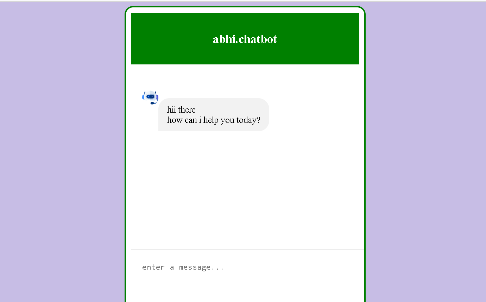

# EchoAI

This project is a simple chatbot interface that interacts with OpenAI's GPT-3.5 model through the OpenAI API. The chatbot receives user input, sends it to the OpenAI API, and displays the response in a conversational format. The front-end is built using HTML, CSS, and JavaScript. The OpenAI API processes the chatbot's responses based on the user’s input.

API Key Setup:

Open the script.js file.
Replace the API_KEY variable with your own OpenAI API key:
const API_KEY = "your-api-key-here";

